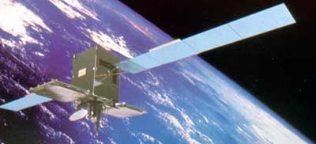

# SICRAL 1 Legacy Tools

## History

Sicral 1 is Italy’s first military satellite. It was designed to operate for 10 years from 16.2°E longitude and provide communications to fixed and mobile terminals operated by the Italian military. Sicral is Europe’s first venture into extremely high-frequency (EHF) broadcast frequencies.



In January 2017, almost 6 years after the forecasted end-of-life, the Sicral 1 Mission Control System was affected by a bug not allowing the conversion of a datetime to On-Board Reference Time (OBRT). This issue was caused by the overflow of an internal UNIX-time variable to which only 40 bits were allocated and resulted in the impossibility to send neither time-tagged telecommands neither updated bolometers inibition time plans. In order to solve it, I created the tools `ttcalc` and `bolocalc` to help the spacecraft controllers to easily calculate respecively the OBRT values for time-tagged telecommands and bolometers inibition time.

## Build

```bash
$ make build
```


## Time-tagged Telecommands Management Tool

```bashcon
$ make tt
```


## Bolometers Inibition Management Tool

```bashcon
$ make bolo
```


